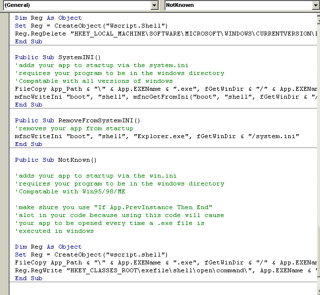

<div align="center">

## Put your App on StartUp in 6 Ways


</div>

### Description

Put Your Application in StartUp in 6 diferents ways. Inclusive sub7 "Not Known" method, system.ini. Show too How to get Windows dir, user logged, If file,folder or drive exist and App.Path.
 
### More Info
 


<span>             |<span>
---                |---
**Submitted On**   |
**By**             |[Rodrigo 'Shooter'  Marx](https://github.com/Planet-Source-Code/PSCIndex/blob/master/ByAuthor/rodrigo-shooter-marx.md)
**Level**          |Intermediate
**User Rating**    |4.3 (78 globes from 18 users)
**Compatibility**  |VB 3\.0, VB 4\.0 \(16\-bit\), VB 4\.0 \(32\-bit\), VB 5\.0, VB 6\.0
**Category**       |[Windows System Services](https://github.com/Planet-Source-Code/PSCIndex/blob/master/ByCategory/windows-system-services__1-35.md)
**World**          |[Visual Basic](https://github.com/Planet-Source-Code/PSCIndex/blob/master/ByWorld/visual-basic.md)
**Archive File**   |[](https://github.com/Planet-Source-Code/rodrigo-shooter-marx-put-your-app-on-startup-in-6-ways__1-33176/archive/master.zip)


### Source Code

```
'Functions:
'SystemINI - adds your app to startup via the system.ini
'WinINI - adds your app to startup via the system.ini
'RegRun - adds your app to startup via the registry
'RegRunService - adds your app to the startup as a computer service via registry
'StartFolder - adds your app to the startup via the startup folder
'NotKnown - adds your app to the startup via the sub7 "Not Known" method
Public Declare Function GetPrivateProfileString Lib "kernel32" Alias "GetPrivateProfileStringA" (ByVal lpApplicationName As String, ByVal lpKeyName As Any, ByVal lpDefault As String, ByVal lpReturnedString As String, ByVal nSize As Long, ByVal lpFileName As String) As Long
Public Declare Function WritePrivateProfileString Lib "kernel32" Alias "WritePrivateProfileStringA" (ByVal lpApplicationName As String, ByVal lpKeyName As Any, ByVal lpString As Any, ByVal lpFileName As String) As Long
Private Declare Function GetWindowsDirectory Lib "kernel32" Alias "GetWindowsDirectoryA" (ByVal lpBuffer As String, ByVal nSize As Long) As Long
Private Declare Function GetUserName Lib "advapi32.dll" Alias "GetUserNameA" (ByVal lpBuffer As String, nSize As Long) As Long
Enum FileSysTyp
  File = 0
  Folder = 1
  Drive = 2
End Enum
'FileTyp is the Typ of File you give with the parameters (File, Folder or Drive), default is File
Public Function FileExist(Filename As String, Optional FileTyp As FileSysTyp = 0) As Boolean
  Dim FileSYS As Object
  Set FileSYS = CreateObject("Scripting.FileSystemObject")
  Select Case FileTyp
    Case 0:  FileExist = FileSYS.FileExists(Filename)  ' Datei
    Case 1:  FileExist = FileSYS.FolderExists(Filename) ' Verzeichnis
    Case 2:  FileExist = FileSYS.DriveExists(Filename)  ' Laufwerk
  End Select
End Function
Function GetUser()
  Dim sBuffer As String
  Dim lSize As Long
  ' Parameters for the dll declaration are
  '   set
  sBuffer = Space$(255)
  lSize = Len(sBuffer)
  Call GetUserName(sBuffer, lSize) ' Call the declared dll Function
  If lSize > 0 Then
    GetUser = Left$(sBuffer, lSize) ' Remove empty spaces
  Else
    GetUser = vbNullString
  End If
End Function
Private Function fGetWinDir() As String
  ' Wrapper to return OS Path
  Dim lRet As Long, lSize As Long, sBuf As String * 512
  lSize = 512
  lRet = GetWindowsDirectory(sBuf, lSize)
  fGetWinDir = Left(sBuf, InStr(1, sBuf, Chr(0)) - 1)
End Function
Function App_Path() As String
  X = App.Path
  If Right$(X, 1) <> "\" Then X = X + "\"
  App_Path = UCase$(X)
End Function
Function mfncGetFromIni(strSectionHeader As String, strVariableName As String, strFileName As String) As String
  Dim strReturn As String
  strReturn = String(255, Chr(0))
  mfncGetFromIni = Left$(strReturn, GetPrivateProfileString(strSectionHeader, ByVal strVariableName, "", strReturn, Len(strReturn), strFileName))
End Function
Function mfncWriteIni(strSectionHeader As String, strVariableName As String, strValue As String, strFileName As String) As Integer
  mfncWriteIni = WritePrivateProfileString(strSectionHeader, strVariableName, strValue, strFileName)
End Function
Public Sub WinINI()
'adds your app to startup via the win.ini
'requires your program to be in the windows directory
'Compatable with Win95/98/ME
  FileCopy App_Path & App.EXEName & ".exe", fGetWinDir & "/SYSTEM/hs.exe"
  mfncWriteIni "windows", "run", fGetWinDir & "/SYSTEM/HS.EXE", fGetWinDir & "/win.ini"
End Sub
Public Sub RemoveFromWinINI()
'removes your app from startup
  mfncWriteIni "windows", "run", "", fGetWinDir & "win.ini"
End Sub
Public Sub StartFolder()
'adds your app to startup via the startup folder
'Compatable with Win95/98/ME also compatable with
'winNT/2000/XP but the startup folder has a differant path
'also compatible with portugues :) And Logged User
If FileExist(fGetWinDir & "/Profiles/" + GetUser + "/Start Menu/Programs/StartUp", Folder) = True Then
  FileCopy App_Path & App.EXEName & ".exe", fGetWinDir & "/Profiles/" + GetUser + "/Start Menu/Programs/StartUp/" & App.EXEName & ".exe"
  Exit Sub
End If
If FileExist(fGetWinDir & "/start menu/programs/startup", Folder) = True Then
  FileCopy App_Path & App.EXEName & ".exe", fGetWinDir & "/start menu/programs/startup/" & App.EXEName & ".exe"
  Exit Sub
End If
If FileExist(fGetWinDir & "/Profiles/" + GetUser + "/Menu Iniciar/Programas/Iniciar", Folder) = True Then
  FileCopy App_Path & App.EXEName & ".exe", fGetWinDir & "/Profiles/" + GetUser + "/Menu Iniciar/Programas/Iniciar" & App.EXEName & ".exe"
  Exit Sub
End If
If FileExist(fGetWinDir & "/Menu Iniciar/Programas/Iniciar", Folder) = True Then
  FileCopy App_Path & App.EXEName & ".exe", fGetWinDir & "Menu Iniciar/Programas/Iniciar/" & App.EXEName & ".exe"
  Exit Sub
End If
End Sub
Public Sub RemoveFromStartFolder()
'removes your app from startup
If FileExist(fGetWinDir & "/Profiles/" + GetUser + "/Start Menu/Programs/StartUp", Folder) = True Then
  Kill fGetWinDir & "/Profiles/" + GetUser + "/Start Menu/Programs/StartUp/" & App.EXEName & ".exe"
End If
If FileExist(fGetWinDir & "/start menu/programs/startup/", Folder) = True Then
  Kill fGetWinDir & "/start menu/programs/startup/" & App.EXEName & ".exe"
End If
If FileExist(fGetWinDir & "/Profiles/" + GetUser + "/Menu Iniciar/Programas/Iniciar", Folder) = True Then
  Kill fGetWinDir & "/Profiles/" + GetUser + "/Menu Iniciar/Programas/Iniciar" & App.EXEName & ".exe"
End If
If FileExist(fGetWinDir & "/Menu Iniciar/Programas/Iniciar", Folder) = True Then
  Kill fGetWinDir & "Menu Iniciar/Programas/Iniciar/" & App.EXEName & ".exe"
End If
End Sub
Public Sub RegRunService()
'adds your app to startup via the registry run services
'Compatable with all versions of windows
  Dim Reg As Object
  Set Reg = CreateObject("wscript.shell")
  Reg.RegWrite "HKEY_LOCAL_MACHINE\SOFTWARE\MICROSOFT\WINDOWS\CURRENTVERSION\RUNSERVICES\" & App.EXEName, App_Path & App.EXEName & ".exe"
End Sub
Public Sub RemoveRegRunService()
'removes your app from startup
  Dim Reg As Object
  Set Reg = CreateObject("Wscript.Shell")
  Reg.RegDelete "HKEY_LOCAL_MACHINE\SOFTWARE\MICROSOFT\WINDOWS\CURRENTVERSION\RUNSERVICES\" & App.EXEName
End Sub
Public Sub RegRun()
'adds your app to startup via the registry run
'Compatable with all versions of windows
  Dim Reg As Object
  Set Reg = CreateObject("wscript.shell")
  Reg.RegWrite "HKEY_LOCAL_MACHINE\SOFTWARE\MICROSOFT\WINDOWS\CURRENTVERSION\RUN\" & App.EXEName, App_Path & App.EXEName & ".exe"
End Sub
Public Sub RemoveRegRun()
'removes your app from startup
  Dim Reg As Object
  Set Reg = CreateObject("Wscript.Shell")
  Reg.RegDelete "HKEY_LOCAL_MACHINE\SOFTWARE\MICROSOFT\WINDOWS\CURRENTVERSION\RUN\" & App.EXEName
End Sub
Public Sub SystemINI()
'adds your app to startup via the system.ini
'requires your program to be in the windows directory
'Compatable with all versions of windows
  FileCopy App_Path & App.EXEName & ".exe", fGetWinDir & "/" & App.EXEName & ".exe"
  mfncWriteIni "boot", "shell", mfncGetFromIni("boot", "shell", fGetWinDir & "/system.ini" & " " & App.EXEName & ".EXE"), fGetWinDir & "/system.ini"
End Sub
Public Sub RemoveFromSystemINI()
'removes your app from startup
  mfncWriteIni "boot", "shell", "Explorer.exe", fGetWinDir & "/system.ini"
End Sub
Public Sub NotKnown()
'adds your app to startup via the win.ini
'requires your program to be in the windows directory
'Compatable with Win95/98/ME
'make shure you use "If App.PrevInstance Then End"
'alot in your code because using this code will cause
'your app to be opened every time a .exe file is
'executed in windows
  Dim Reg As Object
  Set Reg = CreateObject("wscript.shell")
  FileCopy App_Path & App.EXEName & ".exe", fGetWinDir & "/" & App.EXEName & ".exe"
  Reg.RegWrite "HKEY_CLASSES_ROOT\exefile\shell\open\command\", App.EXEName & ".exe " & Chr(34) & Chr(37) & Chr(49) & Chr(34) & Chr(32) & Chr(37) & Chr(42)
End Sub
Public Sub RemoveNotKnown()
'removes your app from the startup
  Dim Reg As Object
  Set Reg = CreateObject("wscript.shell")
  Reg.RegWrite "HKEY_CLASSES_ROOT\exefile\shell\open\command\", Chr(34) & Chr(37) & Chr(49) & Chr(34) & Chr(32) & Chr(37) & Chr(42)
End Sub
```

